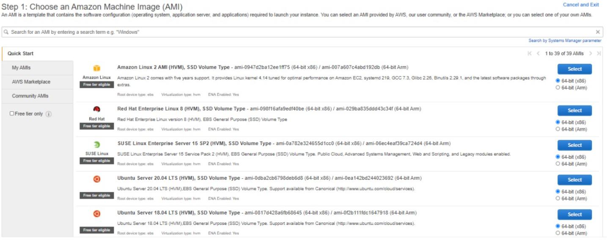
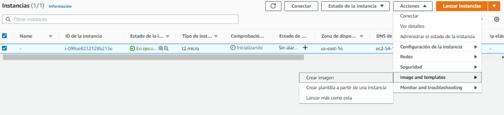
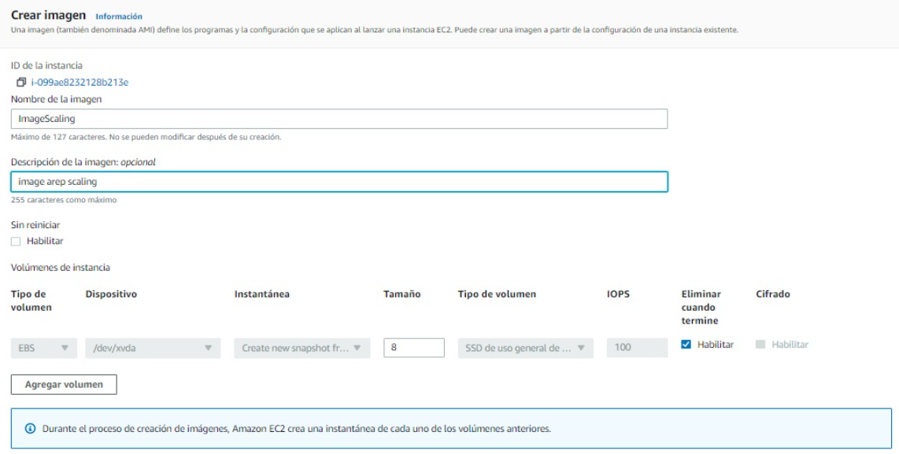
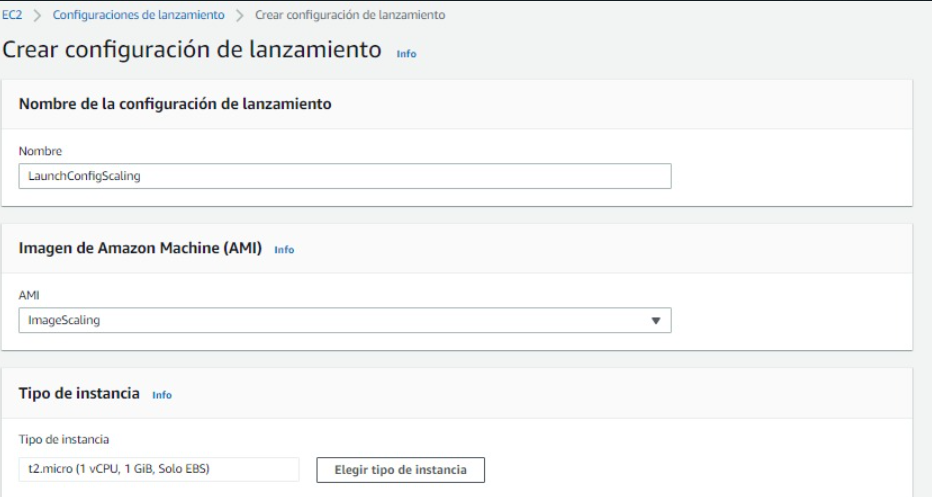
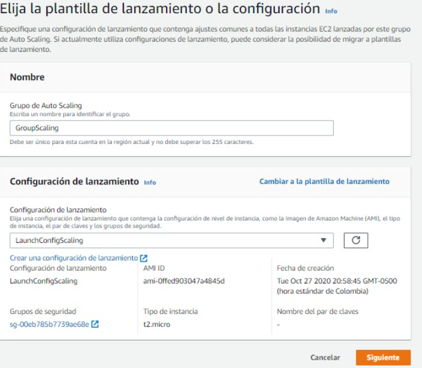
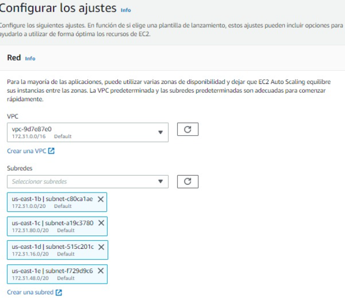
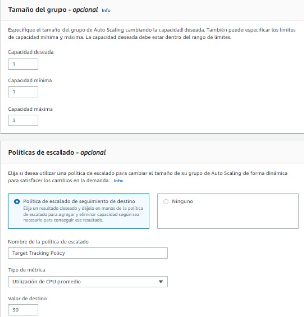
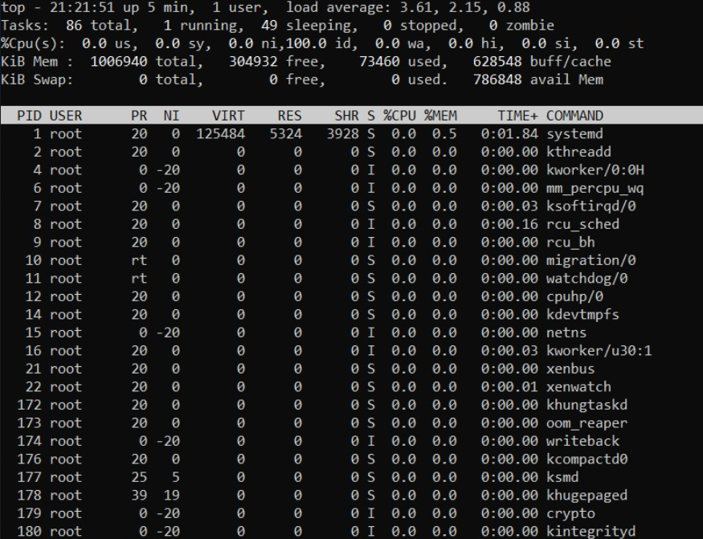
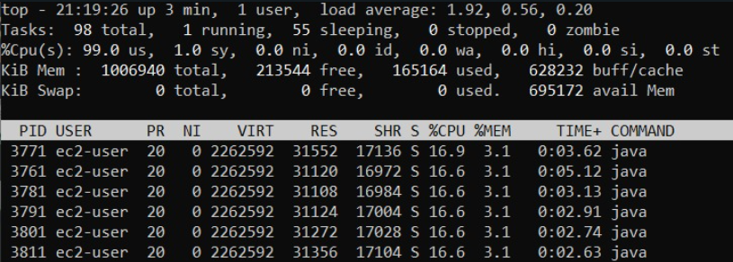

# Auto Scaling Workshop

## Getting Started

The following instructions will allow you to have a copy of the project and run it on your machine.

### Prerequisites

* [Maven](https://maven.apache.org/) - Dependency Management
* [Java 8](https://www.oracle.com/co/java/technologies/javase/javase-jdk8-downloads.html) -  Development Environment 
* [Git](https://git-scm.com/) - Version Control System


## Tutorial

1. Clone el repositorio.
    ```
    git clone https://github.com/juancamilo399/ArepScalingWorkshop.git
    ```
2. Compile el proyecto utilizando el siguiente comando.
    ```
    mvn package
    ```
3. Inicialice una instancia de EC2.

    - Cree una nueva instancia.
    - Seleccione la imagen Amazon Linux 2 AMI (HVM), SSD Volume Type.
    - Seleccione el tamaño t2.micro.
    - 
    
4. Copie las clases del proyecto en la instancia.

    - Usando el protocolo sftp copie las carpetas target/classes en la máquina virtual.
    - Use el siguiente comando.
    ```
   sftp -i <archivo del par de claves> ec2-user@<direccion IP instancia>
    ```
5. Configure la instancia para ejecutar la aplicación.
    
   - Instale java.
   ```
   sudo yum install java-1.8.0
   sudo yum install java-1.8.0-openjdk-devel
   sudo yum remove java-1.7.0-openjdk
   ```
 
   

6. Cree una AMI a partir de la instancia construida.
    - Hacer click derecho sobre la instancia creada y seleccione la opción Image and templates como se observa en la siguiente imagen:
    
    - Cree la imagen.
    
    
7. Cree una configuración de lanzamiento.
   
    - Escriba un nombre para la configuración de lanzamiento.
    - Seleccione la imagen creada anteriormente.
    - Seleccione el tipo de instancia t2.micro.
    - 
    - Seleccione el grupo de seguridad de la instancia anterior.
    - Seleccione el par de llaves de la instancia anterior.
    - Cree la configuración de lanzamiento.
    
8. Cree un grupo de autoescalamiento utilizando la configuración de lanzamiento.
 
    - Escriba un nombre para el grupo y seleccione la configuración de lanzamiento.
    
    - Seleccione la VPC por defecto y algunas sub-redes para tener varias zonas de disponibilidad.
    
    - Continue hasta el paso 4 y cambie la capacidad maxima del grupo a 3 y configure la politica de escalado automático como se observa en la imagen.
    
    - Esta politica se encargará de mantener el consumo de cpu debajo del 30%.
    - Cree el grupo de autoescalamiento.
    
 9. Conectese a la instancia creada con el grupo de autoescalamiento.
 
     - Conéctese usando el siguiente comando.
      ```
      ssh -i <archivo del par de claves> ec2-user@<direccion IP instancia>
      ``` 
      - Verifique el uso de cpu usando el comando top, como se observa en la imagen tenemos 100% de cpu disponible.
      - 
      - Ejecute la aplicación varias veces.
     ```
     nohup mvn exec:java -D "exec.mainClass"="org.eci.arep.Fibonacci" &
     ```
      - Verifique el uso de cpu usando el comando top, como se observa en la imagen tenemos 0% de cpu disponible.
      - 
 
 10. Resultados.
 
      - Como podemos observar en la siguiente imagen se crearon automaticamente dos instancias mas.
      - 
   


## Author

* **Juan Camilo Angel Hernandez** 


## License

This project is under GNU General Public License - see the [LICENSE](LICENSE) file for details.
